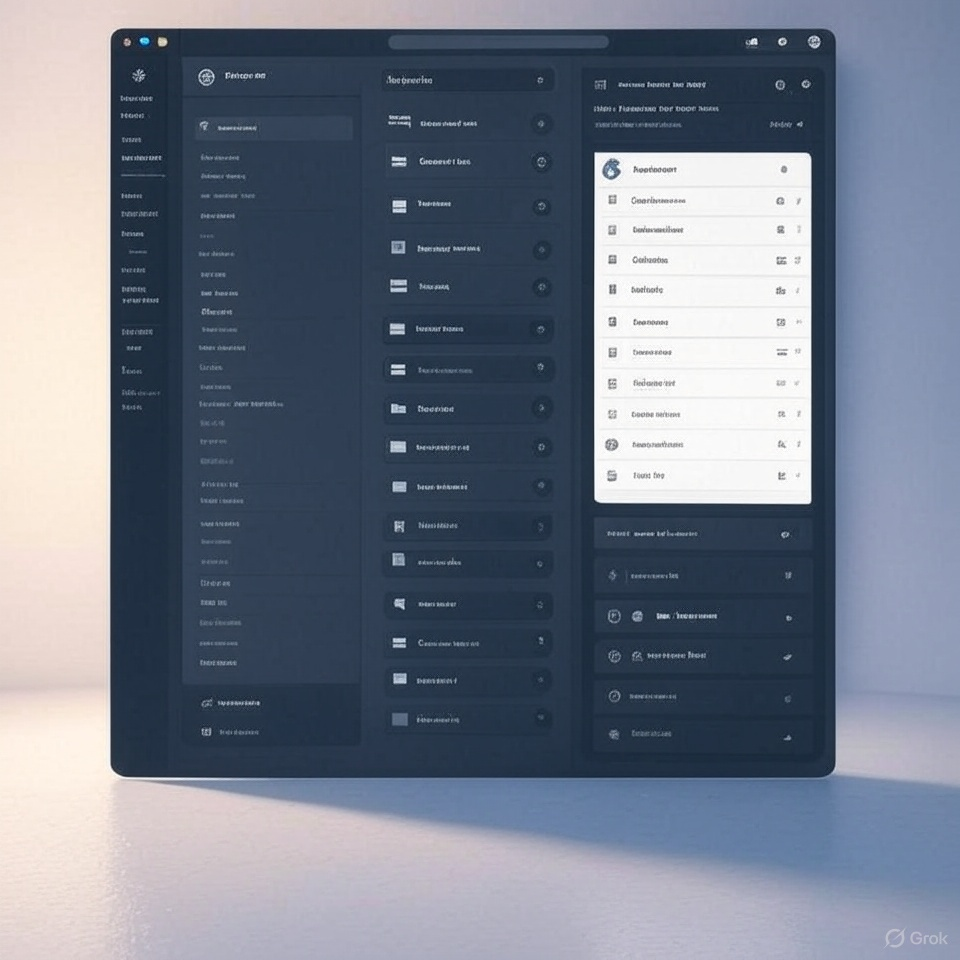
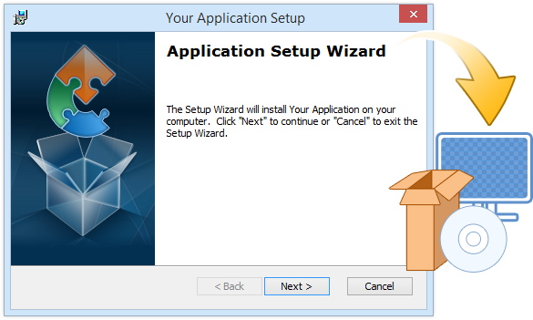

# Hướng Dẫn Sử Dụng Phần Mềm Quản Lý Khách Hàng VNPT IT


_Chào mừng bạn đến với tài liệu hướng dẫn sử dụng phần mềm Quản Lý Khách Hàng!_

> **Mục đích**: Tài liệu này giúp bạn nhanh chóng làm quen với các tính năng chính, từ cài đặt đến sử dụng nâng cao.

---

## Mục lục

- [Giới thiệu](#giới-thiệu)
- [Yêu cầu hệ thống](#yêu-cầu-hệ-thống)
- [Cài đặt](#cài-đặt)
- [Hướng dẫn sử dụng](#hướng-dẫn-sử-dụng)
  - [Thêm khách hàng](#thêm-khách-hàng)
  - [Tạo báo cáo](#tạo-báo-cáo)
- [Câu hỏi thường gặp](#câu-hỏi-thường-gặp)
- [Liên hệ hỗ trợ](#liên-hệ-hỗ-trợ)

---

## Giới thiệu

Phần mềm Quản Lý Khách Hàng giúp doanh nghiệp quản lý thông tin khách hàng, giao dịch, và tạo báo cáo hiệu quả. Tài liệu này hướng dẫn bạn sử dụng phần mềm một cách dễ dàng.

**Lợi ích chính**:

- Quản lý dữ liệu tập trung.
- Giao diện thân thiện, dễ sử dụng.
- Tích hợp báo cáo mạnh mẽ.



_Hình 1: Giao diện chính của phần mềm._

---

## Yêu cầu hệ thống

Trước khi cài đặt, đảm bảo hệ thống của bạn đáp ứng các yêu cầu sau:

| **Yêu cầu**      | **Chi tiết**                      |
| ---------------- | --------------------------------- |
| Hệ điều hành     | Windows 10+, macOS 10.15+, Linux  |
| RAM              | Tối thiểu 4GB, khuyến nghị 8GB    |
| Dung lượng trống | 500MB                             |
| Kết nối internet | Bắt buộc cho đăng nhập và đồng bộ |

> **Lưu ý**: Cập nhật hệ điều hành để tránh lỗi tương thích.

---

## Cài đặt

Để cài đặt phần mềm, làm theo các bước sau:

1. **Tải phần mềm**:

   - Truy cập [trang tải chính thức](https://example.com/download).
   - Chọn phiên bản phù hợp với hệ điều hành.

2. **Chạy file cài đặt**:

   - Mở file tải về (`setup.exe` hoặc `setup.dmg`).
   - Làm theo hướng dẫn trên màn hình.

3. **Đăng nhập**:
   - Sử dụng tài khoản được cung cấp bởi công ty.


_Hình 2: Màn hình chọn thư mục cài đặt._

**Mã kích hoạt (nếu cần)**:

```bash
# Nhập mã này trong phần "Kích hoạt"
ACTIVATE-CODE-12345
```
